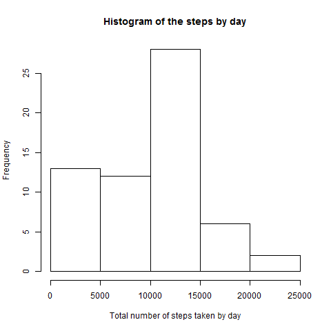
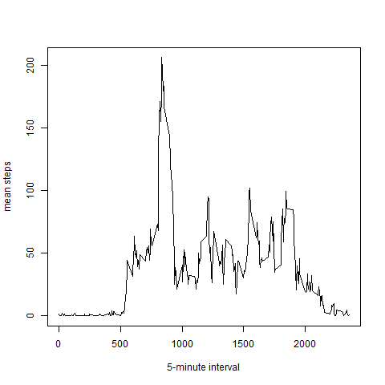
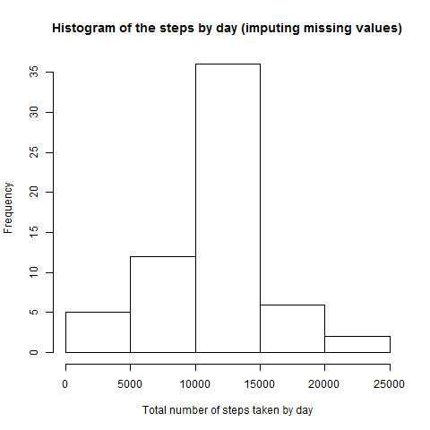

This assignment makes use of data from a personal activity monitoring device. This device collects data at 5 minute intervals through out the day. The data consists of two months of data from an anonymous individual collected during the months of October and November, 2012 and include the number of steps taken in 5 minute intervals each day.

First of all we load the data from the csv file.

```r
data<-read.csv("activity.csv")
```

**What is mean total number of steps taken per day?**

For this part of the assignment, we can ignore the missing values in the dataset.

1. The total number of steps taken per day.
    

```r
library(dplyr)
```


```r
df<-tbl_df(data)
days<-group_by(df,date)
res<-summarise(days, total_steps=sum(steps,na.rm=TRUE))
res
```

```
## Source: local data frame [61 x 2]
## 
##          date total_steps
## 1  2012-10-01           0
## 2  2012-10-02         126
## 3  2012-10-03       11352
## 4  2012-10-04       12116
## 5  2012-10-05       13294
## 6  2012-10-06       15420
## 7  2012-10-07       11015
## 8  2012-10-08           0
## 9  2012-10-09       12811
## 10 2012-10-10        9900
## ..        ...         ...
```
    
2. Histogram of the total number of steps taken each day.

To create a png file with the histogram    


```r
png(filename ="plot1.png")
hist(res$total_steps,xlab="Total number of steps taken by day",main="Histogram of the steps by day")
dev.off()
```

 

```
## RStudioGD 
##         2
```

The histogram

```r
hist(res$total_steps,xlab="Total number of steps taken by day",main="Histogram of the steps by day")
```

 

3. Mean and median of the total number of steps taken per day.
  


```r
summarise(days, mean_steps=mean(steps), median_steps=median(steps))
```

```
## Source: local data frame [61 x 3]
## 
##          date mean_steps median_steps
## 1  2012-10-01         NA           NA
## 2  2012-10-02    0.43750            0
## 3  2012-10-03   39.41667            0
## 4  2012-10-04   42.06944            0
## 5  2012-10-05   46.15972            0
## 6  2012-10-06   53.54167            0
## 7  2012-10-07   38.24653            0
## 8  2012-10-08         NA           NA
## 9  2012-10-09   44.48264            0
## 10 2012-10-10   34.37500            0
## ..        ...        ...          ...
```


**What is the average daily activity pattern?**

1. Make a time series plot (i.e. type = "l") of the 5-minute interval (x-axis) and the average number of steps taken, averaged across all days (y-axis)


```r
interval<-group_by(df,interval)
res2<-summarise(interval, mean=mean(steps,na.rm=TRUE))
res2
```

```
## Source: local data frame [288 x 2]
## 
##    interval      mean
## 1         0 1.7169811
## 2         5 0.3396226
## 3        10 0.1320755
## 4        15 0.1509434
## 5        20 0.0754717
## 6        25 2.0943396
## 7        30 0.5283019
## 8        35 0.8679245
## 9        40 0.0000000
## 10       45 1.4716981
## ..      ...       ...
```

```r
png(filename ="plot2.png")
plot(res2$interval, res2$mean, type="l", ylab="mean steps", xlab="5-minute interval")
dev.off()
```

 

```
## RStudioGD 
##         2
```

```r
plot(res2$interval, res2$mean, type="l", ylab="mean steps", xlab="5-minute interval")
```

 

2. Which 5-minute interval, on average across all the days in the dataset, contains the maximum number of steps?


```r
res3<-summarise(interval, Total_steps=sum(steps))
filter(res3,Total_steps==max(Total_steps))
```

```
## Source: local data frame [0 x 2]
## 
## Variables not shown: interval (int), Total_steps (int)
```

**Imputing missing values**

Note that there are a number of days/intervals where there are missing values (coded as NA). The presence of missing days may introduce bias into some calculations or summaries of the data.

1. Calculate and report the total number of missing values in the dataset (i.e. the total number of rows with NAs)


```r
sum(is.na(data$steps))
```

```
## [1] 2304
```


2. Devise a strategy for filling in all of the missing values in the dataset. The strategy does not need to be sophisticated. For example, you could use the mean/median for that day, or the mean for that 5-minute interval, etc.

The missing values are going to be substituted by the mean for that 5-minute interval.

3. Create a new dataset that is equal to the original dataset but with the missing data filled in.

The original data are

```r
df
```

```
## Source: local data frame [17,568 x 3]
## 
##    steps       date interval
## 1     NA 2012-10-01        0
## 2     NA 2012-10-01        5
## 3     NA 2012-10-01       10
## 4     NA 2012-10-01       15
## 5     NA 2012-10-01       20
## 6     NA 2012-10-01       25
## 7     NA 2012-10-01       30
## 8     NA 2012-10-01       35
## 9     NA 2012-10-01       40
## 10    NA 2012-10-01       45
## ..   ...        ...      ...
```

The new dataset with the missing values substituted by the mean for that 5-minute inerterval is


```r
filled<-mutate(interval,steps = ifelse(is.na(steps), mean(steps, na.rm = T), steps))
filled
```

```
## Source: local data frame [17,568 x 3]
## Groups: interval
## 
##        steps       date interval
## 1  1.7169811 2012-10-01        0
## 2  0.3396226 2012-10-01        5
## 3  0.1320755 2012-10-01       10
## 4  0.1509434 2012-10-01       15
## 5  0.0754717 2012-10-01       20
## 6  2.0943396 2012-10-01       25
## 7  0.5283019 2012-10-01       30
## 8  0.8679245 2012-10-01       35
## 9  0.0000000 2012-10-01       40
## 10 1.4716981 2012-10-01       45
## ..       ...        ...      ...
```


4. Make a histogram of the total number of steps taken each day and Calculate and report the mean and median total number of steps taken per day. Do these values differ from the estimates from the first part of the assignment? What is the impact of imputing missing data on the estimates of the total daily number of steps?


```r
days2<-group_by(filled,date)
res4<-summarise(days2, total_steps=sum(steps), mean_steps=mean(steps))
res4
```

```
## Source: local data frame [61 x 3]
## 
##          date total_steps mean_steps
## 1  2012-10-01    10766.19   37.38260
## 2  2012-10-02      126.00    0.43750
## 3  2012-10-03    11352.00   39.41667
## 4  2012-10-04    12116.00   42.06944
## 5  2012-10-05    13294.00   46.15972
## 6  2012-10-06    15420.00   53.54167
## 7  2012-10-07    11015.00   38.24653
## 8  2012-10-08    10766.19   37.38260
## 9  2012-10-09    12811.00   44.48264
## 10 2012-10-10     9900.00   34.37500
## ..        ...         ...        ...
```

```r
png(filename ="plot3.png")
hist(res4$total_steps,xlab="Total number of steps taken by day",main="Histogram of the steps by day (imputing missing values)")
dev.off()
```

 

```
## RStudioGD 
##         2
```

```r
hist(res4$total_steps,xlab="Total number of steps taken by day",main="Histogram of the steps by day (imputing missing values)")
```

 

**Are there differences in activity patterns between weekdays and weekends?**

For this part the weekdays() function may be of some help here. Use the dataset with the filled-in missing values for this part.


1. Create a new factor variable in the dataset with two levels †“weekday� and “weekend� indicating whether a given date is a weekday or weekend day.


```r
filled<-mutate(filled,wday=weekdays(as.Date(as.character(date))))
filled<-mutate(filled,dayweek=as.factor(ifelse(wday=="Saturday" | wday=="Sunday", "weekend", "weekday")))
filled
```

```
## Source: local data frame [17,568 x 5]
## Groups: interval
## 
##        steps       date interval   wday dayweek
## 1  1.7169811 2012-10-01        0 Monday weekday
## 2  0.3396226 2012-10-01        5 Monday weekday
## 3  0.1320755 2012-10-01       10 Monday weekday
## 4  0.1509434 2012-10-01       15 Monday weekday
## 5  0.0754717 2012-10-01       20 Monday weekday
## 6  2.0943396 2012-10-01       25 Monday weekday
## 7  0.5283019 2012-10-01       30 Monday weekday
## 8  0.8679245 2012-10-01       35 Monday weekday
## 9  0.0000000 2012-10-01       40 Monday weekday
## 10 1.4716981 2012-10-01       45 Monday weekday
## ..       ...        ...      ...    ...     ...
```


2. Make a panel plot containing a time series plot (i.e. type = "l") of the 5-minute interval (x-axis) and the average number of steps taken, averaged across all weekday days or weekend days (y-axis). See the README file in the GitHub repository to see an example of what this plot should look like using simulated data.


```r
interval<-group_by(filled,interval,dayweek)
res5<-summarise(interval, mean=mean(steps))
res5
```

```
## Source: local data frame [576 x 3]
## Groups: interval
## 
##    interval dayweek        mean
## 1         0 weekday 2.251153040
## 2         0 weekend 0.214622642
## 3         5 weekday 0.445283019
## 4         5 weekend 0.042452830
## 5        10 weekday 0.173165618
## 6        10 weekend 0.016509434
## 7        15 weekday 0.197903564
## 8        15 weekend 0.018867925
## 9        20 weekday 0.098951782
## 10       20 weekend 0.009433962
## ..      ...     ...         ...
```


```r
library(lattice)
png(filename ="plot4.png")
xyplot(res5$mean ~ res5$interval | res5$dayweek ,layout=c(1,2), type="l", ylab="Number of steps", xlab="Interval")
dev.off()
```

 

```
## RStudioGD 
##         2
```

```r
xyplot(res5$mean ~ res5$interval | res5$dayweek ,layout=c(1,2), type="l", ylab="Number of steps", xlab="Interval")
```

 
